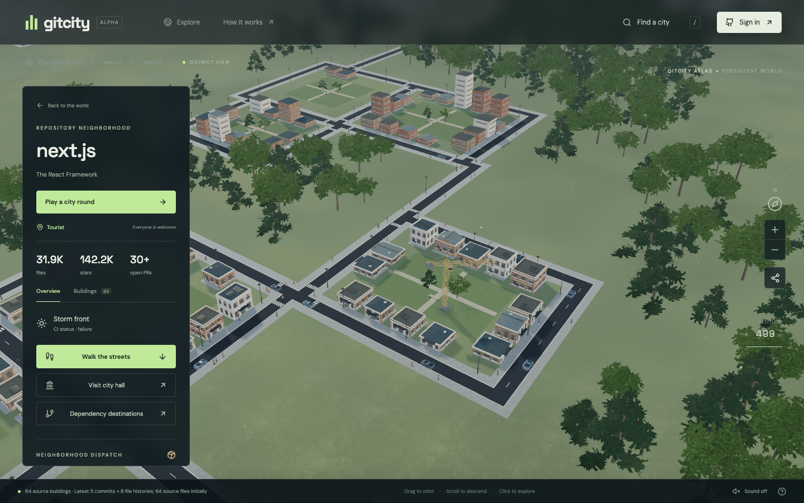
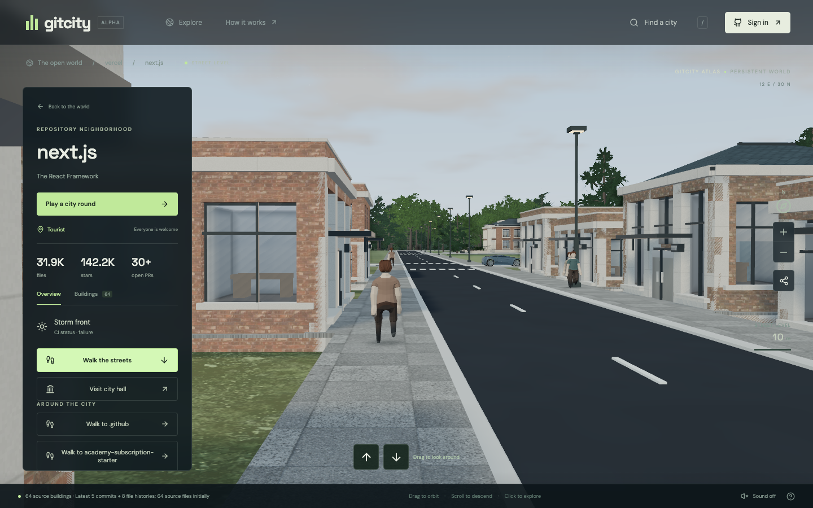

# Gitcity

A persistent, explorable 3D world built from public GitHub repositories. Profiles and organizations become cities, repositories become neighborhoods, and source files become buildings.

**[Explore Gitcity](https://gitcity.co) · [Visit the Next.js neighborhood](https://gitcity.co/vercel/next.js)** — no account required.

[](https://gitcity.co/vercel/next.js)

*Explore from above, then descend to the streets. Actual screenshots from gitcity.co, captured September 6, 2026.*

[](https://gitcity.co/vercel/next.js)

Built with Next.js and Three.js. Buildings are generated from parsed source code and Git history.

## Run

Requires **Node.js 24+** (the server uses Node’s SQLite module).

```sh
npm ci
cp .env.example .env
# Add a base64-encoded 32-byte SESSION_ENCRYPTION_KEY before starting.
npm run dev
```

Open **http://localhost:3000**. Tourists can explore without an account. Set a server-side `GITHUB_TOKEN` for dependable public GitHub API capacity; an unconfigured installation shares GitHub’s small anonymous rate limit.

```sh
npm run build
npm start
```

Production uses the Next API route on Vercel, a managed PostgreSQL database, and shared encrypted sessions. Set `DATABASE_URL`, `SESSION_ENCRYPTION_KEY`, and the exact HTTPS `APP_ORIGIN`, then run `npm run db:migrate` against the intended database before serving requests. Production refuses to fall back to local SQLite. See [the deployment runbook](docs/production-deployment.md). Local development can still use SQLite.

## Addresses are altitude

| Address | Arrival |
| --- | --- |
| `/` | World atlas: repositories and verified dependency connections |
| `/owner` | Owner’s public repository districts |
| `/owner/repo` | Watch the district construct from an aerial view |
| `/owner/repo/path/to/file.ts` | Enter the source building and its archive |
| `/owner/repo/blob/main/path/to/file.ts` | GitHub-style file URL, for the default branch |

Old `#/owner/repo` and `/city?repo=owner/repo` links are normalized. The scene lives in the root layout, so moving through these addresses and browser history keeps one WebGL renderer and one camera.

Drag to orbit, scroll or pinch to change altitude, select a neighborhood or source building, and use WASD or the phone’s movement buttons to walk. `/` opens destination search. Sound begins only after the visitor enables it. Reduced motion, keyboard dialogs, touch controls, and a non-WebGL source-browsing fallback are included.

## What generates the world

- TypeScript’s AST parses JS/JSX/TS/TSX symbols, branches, and imports. Other languages use an explicitly labeled lexical analysis. File byte counts never determine building height.
- Seeded paths choose proportions, roofs, setbacks, and facade details. Parsed symbols and control flow determine massing. No cosmetic operation changes those source metrics.
- A source file is read at a commit ref and verified against its Git blob SHA before analysis. Unknown or unavailable metrics stay unknown.
- A small atlas cache contains **432 verified source samples** from six public repositories, with provenance and timestamps. It stores metrics, not rendered buildings. Opt-out is checked before serving these snapshots; uncharted places are survey sites. `npm run refresh:atlas` regenerates this cache.
- Only the current repository has interactive file detail. Other neighborhoods use real source meshes merged by finish. Ground and roads precede newly discovered buildings; known commit dates determine the initial construction order. Camera movement and returning to a neighborhood do not replay construction.
- Recent commits illuminate windows. Open PRs activate cranes and construction sound. GitHub commit statuses/check runs drive weather. Lighting follows the visitor’s local device clock, including daylight saving; commit timezone samples remain repository metadata. Files with known old commit dates weather visibly; missing history is never treated as staleness.
- Recognized runtime package dependencies resolve to neighborhood links. Currently up to four links to materialized destinations are drawn as flat roads from neighborhood edges. Registry download counts and per-commit timezone scraping are excluded from city generation to keep arrivals focused on source buildings.
- Visiting persists owner-city and repository-neighborhood coordinates in the versioned geography. Collision resolution is recorded once. Code, source caches, models, and geometry can be regenerated.

## Contribution economy

Create a GitHub OAuth app with callback `http://localhost:3000/auth/callback`, then set `GITHUB_CLIENT_ID` and `GITHUB_CLIENT_SECRET`. Production uses the same path at `APP_ORIGIN`. OAuth requests `read:user` and `read:org`; it does not request repository write access. Tokens stay encrypted server-side in expiring database sessions. Sign-in state and logout work across server instances.

On first sign-in, restoration starts automatically. It can also be resumed from the passport:

1. GitHub’s calendar-year commit contribution totals backdate cosmetic credits. Only positive differences from previously verified totals are minted.
2. Public merged PRs are verified individually. The author must be the signed-in player, the repository must be external to them, and a different non-bot account must have merged the work. Self-owned repositories, repositories in organizations the player owns, and self-merges are excluded.
3. Structure reward is `floor(10 × (1 + log10(1 + repository stars)))`. Ten percent is allocated to resolved upstream repository treasuries; the contributor receives the remainder.
4. Every accepted PR has a unique ledger key. The mint, residency, file attribution, and upstream allocation are transactional. Retrying an interrupted restoration cannot mint it twice.
5. Cosmetic credits buy amber windows or a sage palette. Structure credits buy a pavilion alongside city hall. GitHub merge-right holders can spend an earned upstream treasury on a community pavilion. Neither path alters code-derived buildings.

Merged contributors receive resident nameplates on extant files touched by the accepted PR. The noticeboard links actual GitHub “good first issue” opportunities; it does not invent monetary bounties.

GitHub repository permissions determine the civic mayor role. CODEOWNERS determines the alderman role for a selected path, using last matching rule precedence and verified team membership. Unsupported CODEOWNERS syntax grants no authority. The server rechecks GitHub permissions before a treasury mutation.

## Opt out

Add a root `.gitcity-opt-out` file or the `gitcity-opt-out` repository topic. New repository, source, district, and economy requests honor the opt-out. Active repo data is cached for one minute; the featured atlas’s public-visibility/opt-out check is cached for fifteen minutes. An already-open browser can retain a previously delivered view until its next refresh.

## Storage and operating boundaries

`data/gitcity.sqlite` stores players, the idempotency ledger, cosmetics/structures, accepted file attribution, upstream currency, and permanent coordinates. It is ignored by Git. Repository data is a bounded in-memory cache; the featured source metric cache is `server/atlas.json`. No meshes, sprite images, OAuth tokens, or source contents are written to the database.

This is an **alpha implementation**, not a pre-index of all GitHub or a production-tested monetary system. Its current boundaries are explicit:

- Public repositories and their default branches only. Private history and contributions not reported by GitHub’s contribution API are not claimed as restored.
- The first visit analyzes up to 64 source files spread across directories, five recent commits, eight individual file histories, and eight timezone samples. A directory expansion reads up to 256 source files; at most 512 source buildings remain in the detailed model. Any eligible single file can be opened directly. A full nested directory paging system and complete file-history ingestion remain future work.
- GitHub’s recursive-tree truncation is surfaced. Owner exploration currently lists up to 100 recently updated repositories. There is no complete global repository index.
- Dependency resolution currently reads up to twelve npm manifests and resolves eight additional npm packages; Cargo, PyPI, Go module graphs and non-npm usage sources are not implemented.
- Updates poll once a minute while visible. There is no webhook ingestion yet. A GitHub rate limit pauses construction/restoration instead of producing fabricated activity.
- History search recursively splits time ranges around GitHub’s 1,000-result cap. Very large imports may require repeated restoration after rate limits; verified progress survives. GitHub’s 3,000-file PR limit can bound attribution on enormous PRs.
- CODEOWNERS parsing supports ordinary glob rules, directory scopes, and team owners. Escaped-space and bracket patterns are intentionally not granted. Repository `push`/`maintain`/`admin` permissions are the civic authorization signal; branch-specific merge restrictions are not modeled.
- Sessions, job progress, and repo caches run in one Node process. Horizontal deployment needs a shared session/job/cache layer and a database deployment strategy. Restarted jobs are resumed from the passport; the persisted ledger prevents duplicate credits.
- Walking uses a lightweight first-person camera and source-room shells, not a complete physics/collision simulation.

## Verify

```sh
npm test                 # Determinism, AST analysis, governance, minting and atomic spending
npm run lint
npm run build
npm run dev              # In a separate terminal
npm run test:browser      # Headless Chrome; mock API fixtures, no GitHub mutations
```

The browser suite covers search validation, repo and file links, interior/source entry, city hall, tourist sign-in state, back/forward navigation, legacy URLs, owner routes, phone layout, a single persistent canvas, and runtime errors. `scripts/visual-check.mjs` captures the real world UI locally. GitHub OAuth itself requires deployment credentials and is not represented as verified by fixture tests.

GitHub behavior follows the official [REST API guidance](https://docs.github.com/en/rest/using-the-rest-api/best-practices-for-using-the-rest-api), [commit endpoints](https://docs.github.com/en/rest/commits/commits), and [CODEOWNERS rules](https://docs.github.com/en/repositories/managing-your-repositorys-settings-and-features/customizing-your-repository/about-code-owners).

MIT. The original IsoCity-derived code remains in Git history. Fonts are locally served under the licenses in `public/fonts/`.

### Graphics and city expeditions

Source buildings now share a modular façade kit between street detail and merged 3D neighborhood overviews. Glazing, floor bands, parapets, canopies and roof treatments follow source dimensions and path seeds. Raised sidewalks, crossings, benches, lamps and trees provide street detail; desktop adds screen-space ambient occlusion, while phone rendering keeps the direct WebGL path. No bitmap building assets are loaded.

The local field journal remembers city visits and source exploration. Next landmark frames a parsed building; enter it to inspect its source. Bird’s-eye view returns to the neighborhood overview. The dispatch board provides the playable city-service loop described below.

For the exact registration, callback URLs, environment variables and production requirements, see [GitHub OAuth setup](docs/github-oauth.md).


### City stewardship rebuild

Users and organizations now own city locations; repositories occupy permanent neighboring parcels within those cities. The home view stays a 3D urban scene. The renderer uses merged source geometry at a distance, not skyline sprites, and remembers constructed buildings across navigation. Dependency roads are flat surfaces routed from neighborhood edges. Explicit data exploration replaces automatic directory expansion while moving the camera.

The dispatch board runs a playable local city-service loop: accept a job, travel street routes, interact within range, return to the depot, and retain service reputation and personal records. Keyboard walking, building collisions, a minimap, a separate game HUD and touch-friendly street following are implemented. This local reputation cannot buy contribution currency or structure. Run `node scripts/game-test.mjs` against the dev server to exercise a complete round.

See [the game direction and implemented scope](docs/city-game.md) for the city hierarchy, civic co-op design, graphics invariants, geography migration and the next distinct activity mechanics. OAuth is unchanged in this pass.
